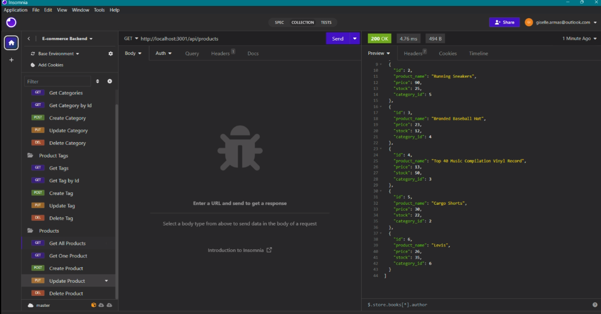

# < E-commerce Backend >

## Description

Given a functional Express.js API
When I add my database name, MySQL username, and MySQL password to an environment variable file
Then I am able to connect to a database using Sequelize
When I enter schema and seed commands
Then a development database is created and is seeded with test data
When I enter the command to invoke the application
Then my server is started and the Sequelize models are synced to the MySQL database
When I open API GET routes in Insomnia Core for categories, products, or tags
Then the data for each of these routes is displayed in a formatted JSON
When I test API POST, PUT, and DELETE routes in Insomnia Core
Then I am able to successfully create, update, and delete data in my database

## Table of Contents

- [Installation](#installation)
- [Usage](#usage)
- [Credits](#credits)
- [License](#license)
- [Features](#features)
- [How to Contribute](#how-to-contribute)
- [Tests](#tests)

## Installation

N/A

## Usage

Here is a walkthrough video link: https://drive.google.com/file/d/11kuAkdcuLQ1SinBHXNaj4gbhdz05LW_c/view 

## Credits

Giselle Reyes, and the instructors in the UM Web Development course for providing assistance with the api routes

## License

## Features

Database with functioning API routes for testing

## How to Contribute

Personal challenge

## Tests

Used VS Code and Insomnia